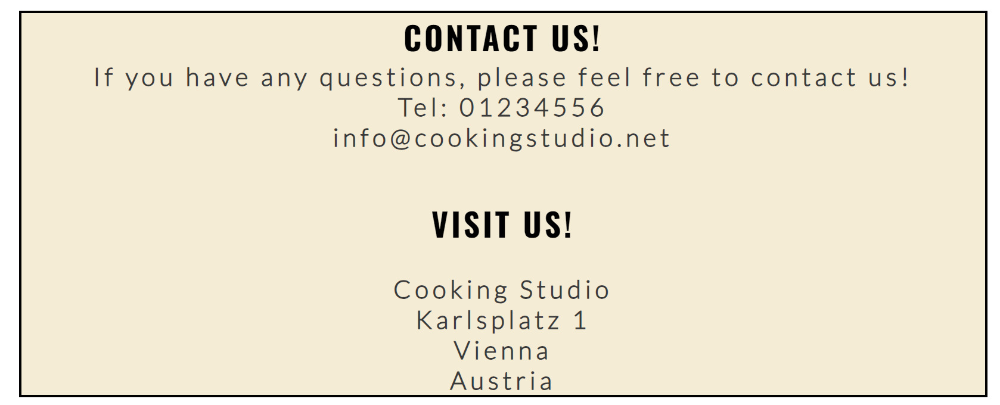

# Cooking Studio
The cooking studio website is a landing page for people who are interested in learning or developing their cooking skills.  The cooking studio offers cooking classes with an instructor by the side.
On this website, users can be able to find all the Information about the cooking studio, timing, pricing, contact information, and a sign-up form.

## Features
* Favicon
    * Favicon is included [Favicon](https://favicon.io/emoji-favicons/cooking)
* Navigation
    * Featured on all three pages, the full responsive navigation bar includes links to the Logo, Home page, Contact and Sign Up page and is identical in each page to allow for easy navigation.
    * This section will allow the user to easily navigate from page to page across all devices without having to revert back to the previous page via the ‘back’ button.
    
* The Home page image
    * The Home page includes a photograph with text explaining the purpose of the site.
    
* The About us Section
    * The About section gives the user important information they need to know about the cooking studio. 
    * This section contains a table with timing, price, days and language of instruction of the cooking classes.
    
* The Footer
    * The footer section includes links to the relevant social media sites, which will open to a new tab to allow easy navigation for the user.
    * The footer is valuable to the user as it encourages them to keep connected via social media.
    
* The Contact Section
    * The Contact section helps the users to get in contact with the cooking studio.
    * This section provides telephone number, email address and street address.
    
* The Sign Up page
   

## Testing
   * I confirmed that this project is responsive and functions on all standard screen sizes using the devtools device toolbar

| Test                                       | Steps                                                                                                                                 | Expected                                                                                              | Actual |
| ------------------------------------------ | ------------------------------------------------------------------------------------------------------------------------------------- | ----------------------------------------------------------------------------------------------------- | ------ |
| Social media links work as expected        | Click on the links on social media in the Footer                                                                                      | Opens correct site in a new tab.                                                                      | Passed |
| Menu works on all devices                  | Open on the device and click on links                                                                                                 | Menu opens and all links work                                                                         | Passed |
| Missing required field in the sign up form | Navigate to signup page and give input in the signup form only for 'First name' and click submit                                      | The form does not submit and a box will appear, tells the user that the field is required.            | Passed |
| Give correct inputs in the signup form     | Navigate to signup page give the correct inputs in the signup form and click submit.User should be redirected to a confirmation page. | Form submits with no warnings and user is redirected to confirmation page.                            | Passed |
| Signup form without Email                  | Navigate to signup page give no inputs for email in the signup form and click submit.                                                 | The form does not submit and an warning is displayed to tell the user that the field is required.     | Passed |
| Incorrect email format in Signup form      | Navigate to signup page give incorrect email format in the signup form and click submit.                                              | The form does not submit and a warning is displayed to tell the user that a valid email is required . | Passed |   
## Validator Testing
   * HTML
      * No errors were returned when passing through the official [W3C validator](https://validator.w3.org/nu/#textarea)
      
   * CSS
      * No errors were found when passing through the official [Jigsaw validator](https://jigsaw.w3.org/css-validator/)
      
   * Accessibility
      * I confirm that the colors and fonts chosen are easy to read and accessible by running it through the lighthouse in devtools.
   * Lighthouse
   
## Unfixed Bugs
   No unfixed bugs
## Deployment
* The site was deployed to GitHub pages. The steps to deploy are as follows:
    * In the GitHub repository, navigate to the Settings tab
    * From the source section drop-down menu, select the Master Branch
    * Once the master branch has been selected, the page provides the link to the completed website. 
The live link can be found here - [Cooking studio](https://soux42.github.io/cookingstudio/)
## Credits
* Content
   * As a reference [Love Running Project](https://code-institute-org.github.io/love-running-2.0/index.html) of [Code Institute](https://learn.codeinstitute.net/) has been used and also codes for header and sozial media links has been taken.
   * Mentor's guidance during the development of the project.
   * The icons in the Footer are taken from [Font Awesome](https://fontawesome.com/)
* Media
   * The photos used on the home and sign up page are from [Pixabay](https://pixabay.com)
   * The photos optimised on [Tinify](https://tinypng.com)
